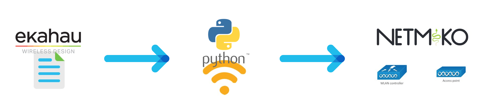

# AP Provisioning Automation
An application pulls configuration information from JSON files generated by Ekahau and then uses Netmiko to configure the lightweight APs from the WLC with the information generated from Ekahau.

## Overview


## Contacts
* Danielle Stacy

## Solution Components
* Netmiko
* Python
* Cisco WLC
* Cisco AP (1562I, 1562D, 1562E, 9130I, 9120I, 3802I, 3802E, 2802I, 3702I, 3702E, 3602I, 3502I, 1815W, 1810W)

## Prerequisistes
-**Ekahau files**: This prototype was written with the assumption that the user will use Ekahau in their environment. Prior to running the program, create a directory that will hold all the JSON files that Ekahau created for the APs connected to the WLC you are working with. Then move all the JSON files to this directory. The files that are needed are the file that identify the access points and the file that contains the radio configuration information (power level and channel).

## Installation/Configuration
1. Clone this directory with git clone `https://github.com/gve-sw/gve_devnet_ap_provisioning_automation` and open the directory.
2. Fill in the information needed in the details.py file. Here, you will provide the name of the directory with your JSON files that you created in the Prerequisites section, the IP address of the WLC, the username of the WLC, and the password of the WLC.
```python
config_file_dir = "configuration file name goes here"
ip_addr = "ip address of WLC access points in config file directory are connected to"
username = "username of the WLC with the ip address above"
password = "password to the WLC"
```
3. Set up a Python virtual environment. Make sure Python 3 is installed in your environment, and if not, you may download Python [here](https://www.python.org/downloads). Once Python 3 is installed in your environment, you can activate the virtual environment with the instructions found [here](https://docs.python.org/3/tutorial/venv.html).
4. Install the requirements with `pip install -r requirements.txt`.

## Usage
The code that reads the information found in the Ekahau configuration JSON files and then applies those configurations to the access points is found in the file provision.py. The file powerByModelandChannel.json contains a matrix that maps the power level that the Ekahau file will provide (in dBm) to one of the 8 power levels that Cisco APs can be configured to. If there is not an available Cisco power level that exactly matches the power level provided by Ekahau, then the closest power level will be configured on the AP. For instance, if the Ekahau JSON file suggests a power level of 12 dBm, but the only Cisco power levels available are 3 (which maps to 13 dBm) or 4 (which maps to 10 dBm), then the code will configure the AP with power level 3 because its 13 dBm is closer to 12 dBm than power level 4 with 10 dBm. The code also expects the name of the Ekahau JSON file that contains the identifying information of the APs to be `accessPoints.json` and the name of the JSON file that contains the power level and channel information for the AP radio to be named `simulatedRadios.json`. If these files have different names in your environment, then you need to change the strings found in lines 18 and 24 in provision.py.

Line 18 which indicates the simulatedRadios.json file name:
```python
radio_file_path = config_file_dir + "/simulatedRadios.json"
```
Line 24 which indicates the accessPoints.json file name:
```python
ap_file_path = config_file_dir + "/accessPoints.json"
```

To run the code, use the command `python3 provision.py`


### LICENSE

Provided under Cisco Sample Code License, for details see [LICENSE](LICENSE.md)

### CODE_OF_CONDUCT

Our code of conduct is available [here](CODE_OF_CONDUCT.md)

### CONTRIBUTING

See our contributing guidelines [here](CONTRIBUTING.md)

#### DISCLAIMER:
<b>Please note:</b> This script is meant for demo purposes only. All tools/ scripts in this repo are released for use "AS IS" without any warranties of any kind, including, but not limited to their installation, use, or performance. Any use of these scripts and tools is at your own risk. There is no guarantee that they have been through thorough testing in a comparable environment and we are not responsible for any damage or data loss incurred with their use.
You are responsible for reviewing and testing any scripts you run thoroughly before use in any non-testing environment.
